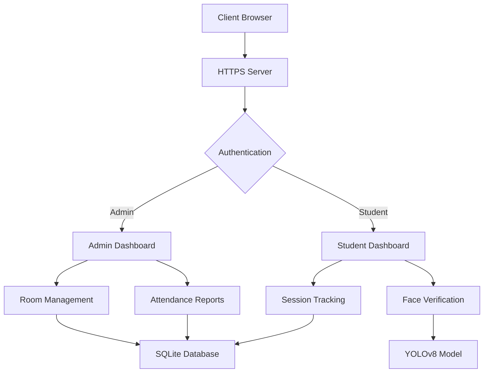

```markdown
# Attendance System with Face Recognition

A Flask-based web application for tracking student attendance using face recognition and WiFi BSSID verification. Features separate dashboards for administrators and students with real-time tracking capabilities.

## Features

- **Admin Features**:
  - Create/manage virtual classrooms
  - View real-time student presence
  - Download full attendance reports
  - Close classrooms and log out all students
  - WiFi network restriction enforcement

- **Student Features**:
  - Secure face registration
  - Multi-factor authentication (password + face)
  - Session duration tracking
  - Personal attendance history download
  - Automatic session maintenance

## Prerequisites

- Python 3.8+
- OpenSSL
- Web browser with camera access
- Required Packages:
  ```bash
  pip install flask flask-sqlalchemy flask-bcrypt opencv-python numpy ultralytics flask-session
  ```

## Installation

1. **Clone Repository**:
   ```bash
   git clone https://github.com/yourusername/attendance-system.git
   cd attendance-system
   ```

2. **Set Up Virtual Environment**:
   ```bash
   python -m venv venv
   source venv/bin/activate  # Linux/Mac
   venv\Scripts\activate    # Windows
   ```

3. **Install Dependencies**:
   ```bash
   pip install -r requirements.txt
   ```

4. **Generate SSL Certificates**:
   ```bash
   openssl req -x509 -newkey rsa:4096 -nodes -out cert.pem -keyout key.pem -days 365
   ```

5. **Initialize Databases**:
   ```bash
   flask shell
   >>> db.create_all()
   >>> exit()
   ```

## Configuration

1. **YOLO Model Setup**:
   - Place `yolov8n.pt` in project root (download from Ultralytics)
   
2. **Environment Variables**:
   ```bash
   export FLASK_SECRET_KEY='your-secret-key'
   ```

## Usage

### Admin Portal

1. **Access**:
   - Navigate to `https://localhost:5000/login_admin`

2. **Registration**:
   - First-time admin registration requires secret key (configure in code)

3. **Create Classroom**:
   - After login, enter room code in dashboard
   - System captures current WiFi BSSID automatically

4. **Manage Attendance**:
   - View real-time student presence
   - Close classrooms to log out all students
   - Download CSV reports from dashboard

### Student Portal

1. **Registration**:
   - Visit `https://localhost:5000/register_student`
   - Provide student ID, username, password
   - Capture face using webcam interface

2. **Login**:
   - Select active classroom from dropdown
   - Enter password and perform face verification
   - System validates WiFi network match

3. **Session Maintenance**:
   - Automatic session extension with activity
   - Manual logout available in dashboard

4. **Attendance Records**:
   - Download personal history as CSV
   - Includes room codes and session durations

## Technical Architecture



## Security Features

- Encrypted HTTPS communication
- Bcrypt password hashing
- Session-based authentication
- WiFi BSSID verification
- Face encoding storage (Base64)
- Automatic session termination

## Troubleshooting

**Face Recognition Issues**:
- Ensure good lighting conditions
- Remove obstructions (glasses/masks)
- Position face centrally in frame

**Network Errors**:
- Verify matching WiFi network
- Check admin's current BSSID
- Confirm room is active

**Session Problems**:
- Refresh page to update status
- Manually log out and retry
- Clear browser cache if persistent

## API Endpoints

| Endpoint | Method | Description |
|----------|--------|-------------|
| `/update_activity` | POST | Updates student active timestamp |
| `/active_students` | GET | Returns JSON of current attendees |
| `/verify_face` | POST | Processes face verification attempt |

## License

MIT License - See [LICENSE](LICENSE) for details

## Contributing

1. Fork repository
2. Create feature branch
3. Submit pull request
4. Include detailed documentation

## Support

For assistance, contact: [kailainathan2006@gmail.com](mailto:kailainathan2006@gmail.com)