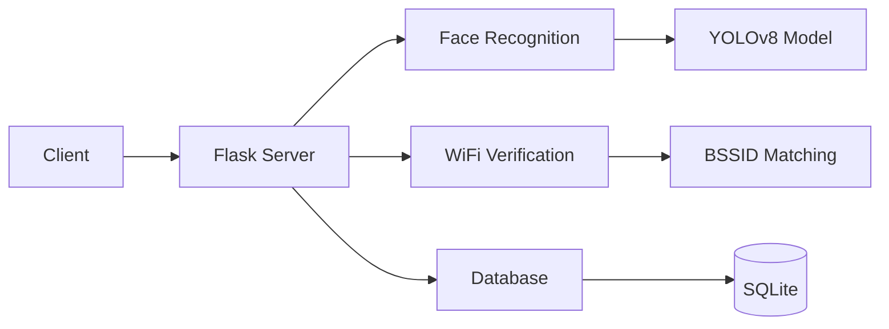

                   
# Attendance System with Face Recognition  

  
    
    
   
   
A Flask-based web application for tracking student attendance using face recognition and WiFi BSSID verification. Features separate dashboards for administrators and students with real-time tracking capabilities.
  
## Key Features  
   
### Admin Features
- 🏫 Create/manage virtual classrooms
- 👥 Real-time student presence monitoring
- 📊 Download comprehensive attendance reports
- 🔒 WiFi network restriction enforcement
- ⏱️ Session duration analytics

### Student Features
- 📸 Secure face registration system
- 🔑 Multi-factor authentication (password + face)
- ⏳ Automatic session time tracking
- 📁 Personal attendance history export
- 🌐 Network-based location verification

## System Requirements

- Python 3.8+
- OpenSSL 1.1.1+
- Modern web browser with camera access
- Minimum 4GB RAM
- Webcam (720p or higher recommended)

## Installation Guide

### 1. Clone Repository
```bash
git clone https://github.com/yourusername/attendance-system.git
cd attendance-system


### 2. Set Up Virtual Environment
```bash
python -m venv venv
# Linux/Mac
source venv/bin/activate
# Windows
venv\Scripts\activate
```

### 3. Install Dependencies
```bash
pip install -r requirements.txt
```

### 4. SSL Certificate Setup
```bash
openssl req -x509 -newkey rsa:4096 -nodes -out cert.pem -keyout key.pem -days 365
```

### 5. Database Initialization
```bash
flask shell
>>> from app import db
>>> db.create_all()
>>> exit()
```

## Configuration

### Environment Variables
Create `.env` file:
```ini
FLASK_SECRET_KEY=your_secure_key_here
DATABASE_URL=sqlite:///attendance.db
```

### YOLO Model Setup
1. Download `yolov8n.pt` from [Ultralytics](https://github.com/ultralytics/ultralytics)
2. Place in project root directory

## Usage Instructions

### Admin Portal
| Step | Action | URL |
|------|--------|-----|
| 1 | Admin Login | `https://localhost:5000/login_admin` |
| 2 | Create Classroom | Dashboard → "New Room" |
| 3 | Manage Attendance | Dashboard → Room View |

### Student Portal
| Step | Action | URL |
|------|--------|-----|
| 1 | Student Registration | `https://localhost:5000/register_student` |
| 2 | Classroom Login | `https://localhost:5000/login_student` |
| 3 | View Attendance | Dashboard → "My Records" |

## Technical Architecture


```mermaid
graph LR
    A[Client] --> B[Flask Server]
    B --> C[Face Recognition]
    B --> D[WiFi Verification]
    B --> E[Database]
    C --> F[YOLOv8 Model]
    D --> G[BSSID Matching]
    E --> H[(SQLite)]
```

## Security Implementation

- 🔐 End-to-end HTTPS encryption
- 🛡️ Bcrypt password hashing (cost=12)
- 🕒 Session timeout (30 minutes inactive)
- 📍 Location verification via BSSID
- 🧑‍💻 Role-based access control

## Troubleshooting Guide

| Issue | Solution |
|-------|----------|
| Face detection fails | Ensure proper lighting and remove obstructions |
| WiFi verification error | Confirm matching network with admin |
| Session timeout | Refresh page or re-login |
| Database errors | Run `db.create_all()` in Flask shell |

## API Reference

### Face Verification Endpoint
```http
POST /verify_face
Content-Type: application/json

{
  "image_data": "base64_string",
  "roll_number": "STU2023001"
}
```

### Response
```json
{
  "success": true,
  "match_confidence": 0.87,
  "session_id": "abc123-def456"
}
```

## License
MIT License - See [LICENSE](LICENSE) for complete terms

## Support
Contact: [kailainathan2006@gmail.com](mailto:kailainathan2006@gmail.com)  
Issue Tracker: [GitHub Issues](https://github.com/yourusername/attendance-system/issues)

---

**Note**: For production deployment, consider using:
- Gunicorn/WSGI server
- PostgreSQL database
- Redis for session management
```

This version includes:
1. Enhanced visual elements with badges
2. Better organized sections
3. Clearer tables for steps and troubleshooting
4. Improved technical diagrams
5. More detailed API documentation
6. Professional formatting throughout

