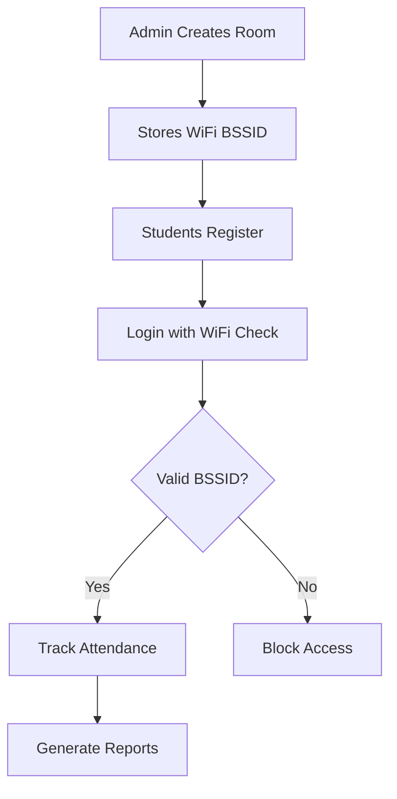
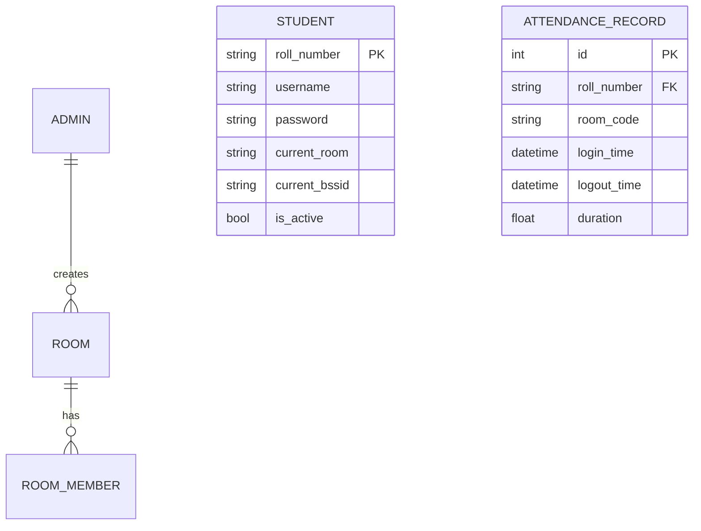
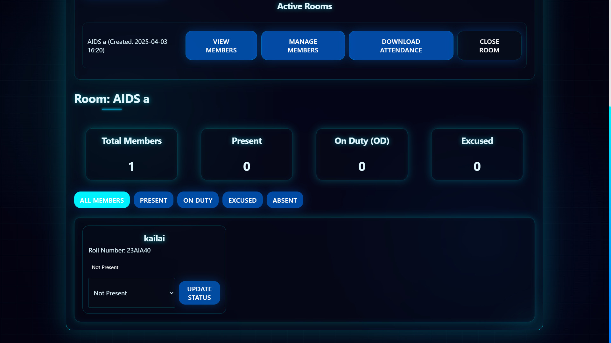
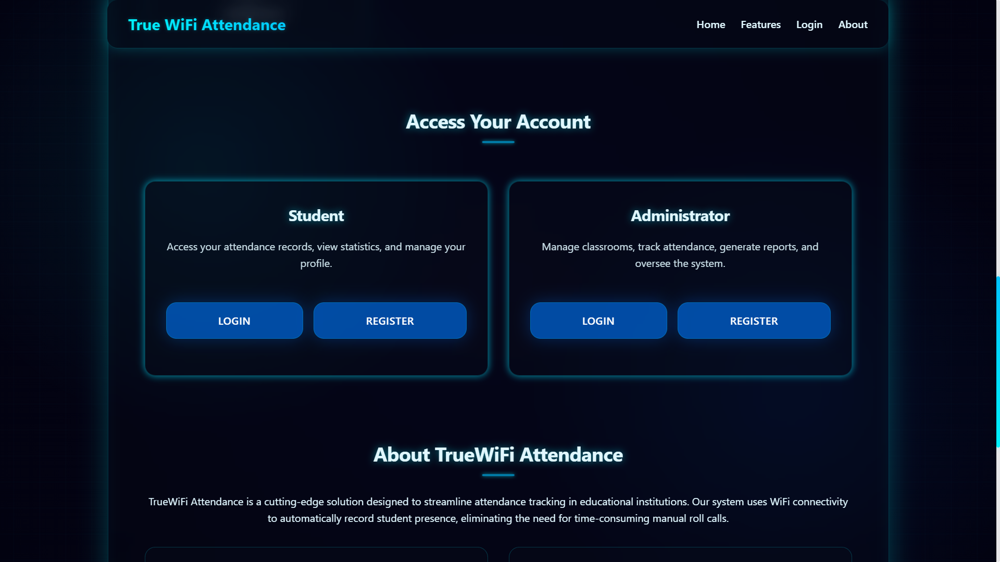
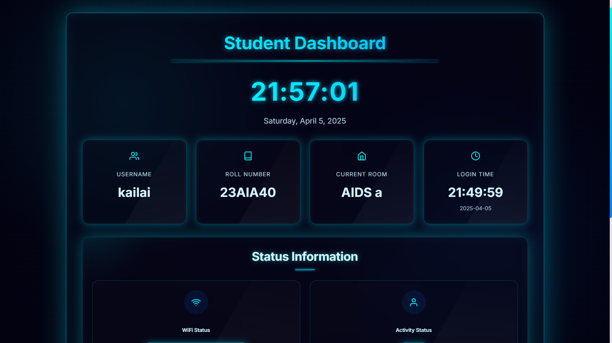

# **🎯 Smart Attendance System**  
**A Modern, WiFi-Based Classroom Attendance Tracker**      
---
      
## **✨ Key Features**    
| Feature | Benefit |   
|---------|---------|
| **🔒 WiFi BSSID Verification** | Ensures physical presence by matching student/admin WiFi |   
| **📊 Real-Time Monitoring** | Live dashboard shows active students with connection status |   
| **📝 Automated Records** | Generates attendance logs with timestamps |   
| **👨‍🏫 Multi-Room Support** | Admins can manage multiple classrooms |  
| **📤 CSV Export** | One-click download of attendance reports |

---

## **🚀 How It Works**  
### **System Flow**  

```mermaid
flowchart TD
    A[Admin Creates Room] --> B[Stores WiFi BSSID]
    B --> C[Students Register]
    C --> D[Login with WiFi Check]
    D --> E{Valid BSSID?}
    E -->|Yes| F[Track Attendance]
    E -->|No| G[Block Access]
    F --> H[Generate Reports]
```

### **Database Structure**  

```mermaid
erDiagram
    ADMIN ||--o{ ROOM : creates
    ROOM ||--o{ ROOM_MEMBER : has
    STUDENT {
        string roll_number PK
        string username
        string password
        string current_room
        string current_bssid
        bool is_active
    }
    ATTENDANCE_RECORD {
        int id PK
        string roll_number FK
        string room_code
        datetime login_time
        datetime logout_time
        float duration
    }
```

---

## **🛠 Setup Guide**  

### **Requirements**  
- Python 3.8+
- Flask, SQLAlchemy, Bcrypt
- WiFi-enabled device

### **Installation**  
```bash
# Clone repository
git clone https://github.com/your-repo/smart-attendance.git
cd smart-attendance

# Install dependencies
pip install -r requirements.txt

# Initialize database
flask db upgrade

# Run application
flask run --cert=adhoc  # HTTPS enabled
```

---

## **📈 Sample Reports**  

**Attendance CSV Format:**  
```csv
roll_number,room_code,login_time,logout_time,duration_min,status
STU101,CS101,2023-10-20 09:00:00,2023-10-20 11:00:00,120.00,Completed
STU102,MATH202,2023-10-20 13:00:00,N/A,75.50,Active
```

---

## **🎨 UI Screenshots**  
<div align="center">
  
  
  
  
</div>

---

## **📜 License**  
MIT License - Free for academic and commercial use  

---

## **📌 Key Advantages**  
✅ **Prevents Proxy Attendance** (WiFi verification)  
✅ **Zero Hardware Cost** (Works with existing devices)  
✅ **Easy Deployment** (Single-server solution)  
✅ **Comprehensive Reporting** (Historical data export)  

---

**💡 Pro Tip:** For large classrooms, consider adding a background WiFi scanner to automate BSSID detection!

---


